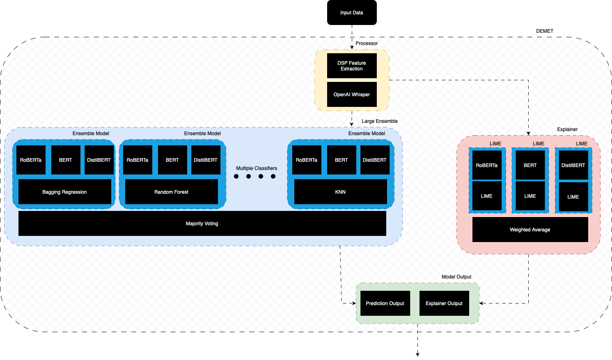
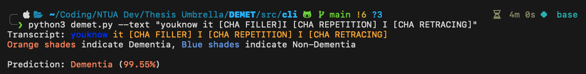

# DEMET

## Overview

This research was conducted as part of the COMFORTAGE project,
formally known as "Prediction, Monitoring and Personalized Recommendations for Prevention and Relief of Dementia and Frailty",
which aims to develop personalized and adaptive solutions 
for dementia and frailty prevention and management. This effort aims to establish a pan-European framework for prevention 
and intervention in dementia and frailty. It bolsters a multidisciplinary approach, combining expertise from the fields of 
medicine, social sciences, humanities and technology. 

Our contribution to the COMFORTAGE project is the development of DEMET, or Dementia Explainable Transformer, an explainable, AI-driven
cognitive assessment agent for dementia detection through spontaneous speech. DEMET utilises state-of-the-art deep learning models 
and explainability techniques to provide an accurate prediction along with detailed insights into the model's decision-making process.
DEMET's architecture is designed to be highly scalable and efficient, along with allowing for easy integration into the COMFORTAGE project. 
Our work is largely based upon the utilisation of phonogical features for explainability purposes and the implementation of 
ensemble learning techniques to improve model performance. We also propose an ensemble explainer framework that, with further 
investigation and development, can provide a more comprehensive understanding of the model's decision-making process and improve 
the overall explainability of the model. The ensemble explainer framework is designed to take into consideration the attributions of tokens provided 
by different trasnformer models in order to interpret how different phonological features in the patient's speech contrisolution 
the model's decision. 

<p align="center">
    
</p>

DEMET provides both server and client-side implementations. The server-side implementation runs the model 
and explainer, along with an API that can easily be accessed by the client-side implementation. The client-side has a user-friendly and easy-to-use
interface that allows for textual and audio input, and provides the user with the model's prediction and explanation. It can be 
used through the web application and the CLI tool application.

<p align="center">
    
</p>

## Data
The data used in this research was provided by [DementiaBank](https://dementia.talkbank.org), from which we used two corpuses, Lu and Pitt to train and evaluate 
our models and explainability methods. 

## Installation
You can view the `requirements.txt` file [here](./requirements.txt).
To install run this in your terminal:

```bash
pip install -r requirements.txt
```

You probably need to activate a new conda environment.

## API Endpoints
### 1. Predict Audio\
**URL:** /predict_audio\
**Method:** POST\
**Description:** This endpoint accepts an audio file, transcribes it, and then predicts the outcome based on the transcribed text.

**Request:**\
**file:** An audio file to be transcribed and analyzed.

**Response:**\
**decision:** The predicted decision based on the audio transcription.\
**probability:** The probability associated with the predicted decision.\
**explanation:** Explanation for the predicted decision.\

### 2. Predict Text\
**URL:** /predict_text\
**Method:** POST\
**Description:** This endpoint accepts a text input and predicts the outcome based on the provided text.\

**Request:**\
**text:** A JSON object containing the text to be analyzed.\

**Response:**\
**decision:** The predicted decision based on the text input.\
**probability:** The probability associated with the predicted decision.\
**explanation:** Explanation for the predicted decision.\

## Usage
To start the server go to the API directory and start it with:

```bash
python3 app.py
```

You can then either use the CLI tool or the Web Application to interact with DEMET.

## Disclaimer
This is not a final product, it is a proof of concept on the advantages of ensemble learning in explainability, and 
a new approach on how explainability is provided through the phonological features in a patient's speech. 


